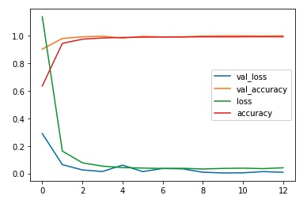
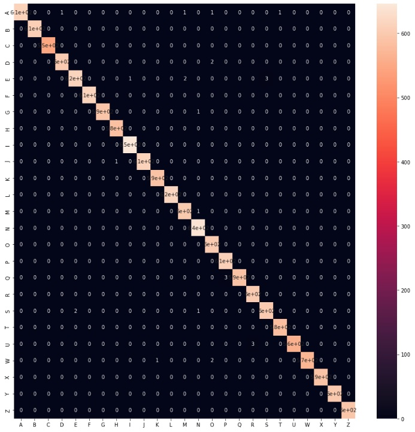
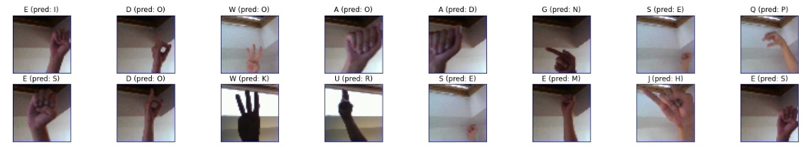
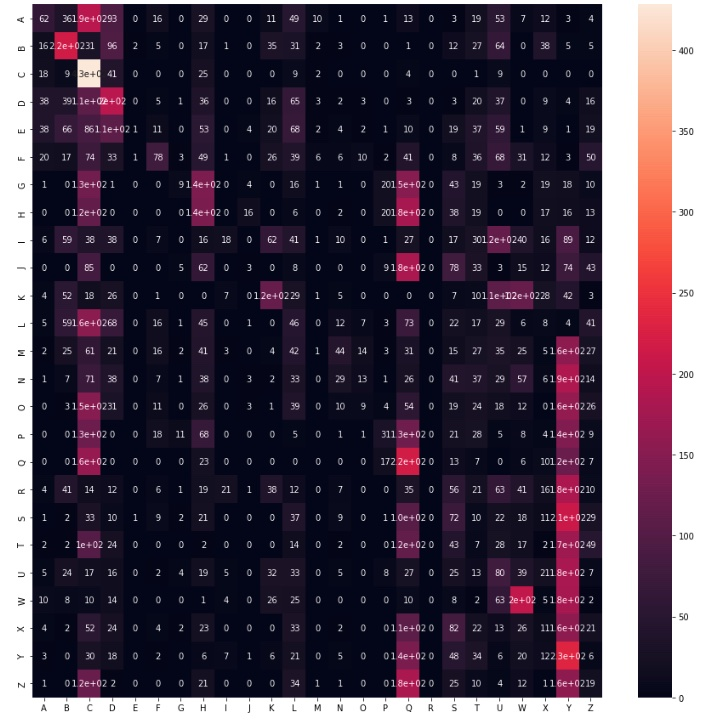
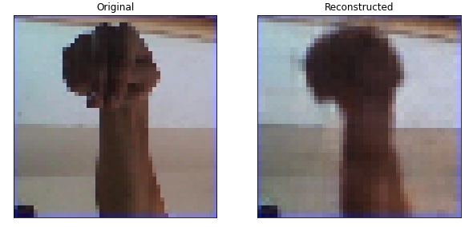
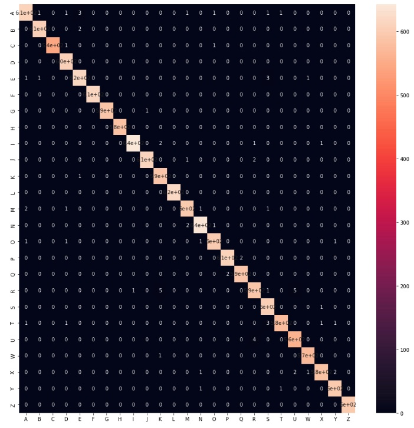
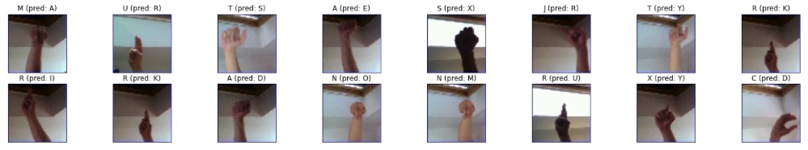

# ASL-Alphabet Image Classification

This small project contains approaches to classify letter/alphabet images that contain gestures of the American Sign Language (ASL). Deep Learning models are used with Keras, including (1) CNNs defined from scratch, (2) transfer learning with models pre-trained on ImageNet and (3) autoencoders in combination with random forests.

**TLDR**: The CNN defined and trained from scratch reaches an accuracy of `0.998` on the test set! Probably, in part, because this is a very easy and clean dataset.

Notes:

- The project repository can be found here: [asl_alphabet_image_classification](https://github.com/mxagar/asl_alphabet_image_classification).
- Some of the starter code and examples were taken from a [Datacamp](https://www.datacamp.com) guided project: [ASL Recognition with Deep Learning](https://app.datacamp.com/learn/projects/509).
- :warning: This is an experimental project where some Keras functionalities related to CNNs are showcased; however, these are not systematically applied to find the optimum solution. The motivation and performance of the models is discussed in a dedicated [section](#discussion-on-the-used-models), and at the end a non-exhaustive list of [possible improvements](#next-steps-improvements) is provided.

## Table of Contents

- [ASL-Alphabet Image Classification](#asl-alphabet-image-classification)
  - [Table of Contents](#table-of-contents)
  - [The Dataset](#the-dataset)
  - [How to Use This](#how-to-use-this)
    - [Dependencies](#dependencies)
  - [Discussion on the Used Models](#discussion-on-the-used-models)
    - [CNN from Scratch](#cnn-from-scratch)
    - [Fine-Tuning and Transfer Learning of ResNet50 and VGG16](#fine-tuning-and-transfer-learning-of-resnet50-and-vgg16)
    - [Autoencoder Compression + Random Forest](#autoencoder-compression--random-forest)
  - [Preliminary Conclusions](#preliminary-conclusions)
  - [Next Steps, Improvements](#next-steps-improvements)
  - [Authorship](#authorship)
  - [Requirements](#requirements)

## The Dataset

The original dataset can be downloaded from Kaggle: [asl-alphabet](https://www.kaggle.com/datasets/grassknoted/asl-alphabet). It consists of `50 x 50 px` color images in which gestures of the `A-Z` symbols are displayed with hands on different backgrounds and lighting conditions. 


For this project, special symbols were ignored (i.e., `nothing`, `space`, `del`) and only the original `train` split was taken. Then, that `train` split was further segregated into the `train` and `test` subsets, with the following sizes:

- `train`: 60,000 observations
- `test`: 15,000 observations (20%)
- labels: 25 (`A-Z`)

The dataset is well balanced: each character has around 2,400 observations in the `train` split and around 600 in the `test` split. Additionally, the images require very little pre-processing:

- Pixel values were mapped to `[0,1]`.
- Images were converted into numpy arrays or tensors.
- In the case of transfer learning, pixel values were scaled to the region in which the pre-trained model was fit into ImageNet.

## How to Use This

The project folder contains the following files and directories:

```
asl_alphabet.ipynb      # Main notebook
assets                  # Auxiliary images
requirements.txt        # Dependencies
utils.py                # Helper script: dataset loading
```

The main notebook [`asl_alphabet.ipynb`](asl_alphabet.ipynb) carries out all the research and almost everything is implemented there; the notebook uses [`utils.py`](utils.py) to load the dataset with the specifications mentioned in the previous section.

First, the [dataset](https://www.kaggle.com/datasets/grassknoted/asl-alphabet) needs to be downloaded to the folder `data`, where [`utils.py`](utils.py) expects it.

Then, we have two options:

1. Clone this repository, install the [dependencies](#dependencies) and excute [`asl_alphabet.ipynb`](asl_alphabet.ipynb) locally.
2. Open [`asl_alphabet.ipynb`](asl_alphabet.ipynb) in Google Colab:

[](https://colab.research.google.com/github/mxagar/asl_alphabet_image_classification/blob/main/asl_alphabet.ipynb)

For the last option, the local dataset can be uploaded to your GDrive and from there to the virtual machine instance of your Colab workspace. The steps are explained in the notebook.

### Dependencies

You should create a python environment (e.g., with [conda](https://docs.conda.io/en/latest/)) and install the dependencies listed in the [`requirements.txt`](requirements.txt) file; no specific versions are needed. A short summary of commands required to have all in place is the following:

```bash
conda create -n asl tensorflow python=3.7.13
conda activate asl
conda install pip
pip install -r requirements.txt
```

## Discussion on the Used Models

As mentioned in the introduction, this is an experimental (and on-going) project in which I try some Keras functionalities related to CNNs on an *easy* dataset. The used models and their accuracy metric on the test dataset are the following:

1. A from scratch defined and trained CNN model: `0.998`.
2. A frozen VGG16 backbone with a fully connected classifier: `0.149`.
3. An autoencoder from which the compressed representations are used to fit a random forest: `0,995`.

If our goal is to define and train the most accurate model, the first model wins. In the following, notes about the motivation, definition, training and evaluation of each model are provided. Additionally, [possible improvements](#next-steps-improvements) are listed at the end.

### CNN from Scratch

The model is rather simple: it consists of 4 convolution-pooling layers that increase the number of channels from `16` to `128` by reducing the activation map size until `3 x 3`. The final classifier consists of two fully connected layers with dropout in-between to control overfitting. It resembles the good old [LeNet](https://en.wikipedia.org/wiki/LeNet).

The learning curves of the RMSProp optimization algorithm behaved nicely and the training stopped at epoch 12 due to early stopping on the validation split (0.2):



The confusion matrix looks also very nice:



The following figure shows 16 of the 27 / 15000 missclassified images:



### Fine-Tuning and Transfer Learning of ResNet50 and VGG16

I tried two backbones or networks trained on [ImageNet](https://www.image-net.org):

- [ResNet50](https://en.wikipedia.org/wiki/Residual_neural_network)
- [VGG16](https://www.geeksforgeeks.org/vgg-16-cnn-model/)

And I applied two techniques

- Transfer learning, i.e., training of the appended classifier only, with weights of the pre-trained network frozen.
- Fine-tuning: complete training of the network, starting with the pre-trained weights.

My initial assumption was that ResNet50 with fine-tuning should be the best option, due to the specific image classes and the large dataset. However, it's the VGG16 with transfer learning the one that best performed &mdash; although the accuracy is very bad: `0.149` compared to the other models.

In the following, the confusion matrix achieved with this approach (a complete mess :sweat_smile:):



This model type definitely needs a better analysis of what's going on from my side.

### Autoencoder Compression + Random Forest

Autoencoders are able to compress data observations, i.e., images, to latent vectors. They achieve that with an encoder-decoder architecture which (1) reduces the dimensionality of the input sample to a bottleneck and then (2) expands it to obtain a reconstructed representation that is intended to be as close a possible to the input.

The used encoder architecture is very similar to the CNN model created from scratch; the decoder expands the latent vector with transpose convolutions. The following is an examples of an original image and its reconstruction:



Once the autoencoder was trained, I used it to encode all the images to vectors of size `512`; then, I attached two classifiers:

- A logistc regression, to provide some intepretability to the model choices.
- A random forest, to be able to reach high accuracies.

Both models were trained with a small grid search using cross-correlation (i.e., hyperparameter tuning). Unfortunately, the logistic regression was not able o converge, and the results of the best random forest are shown, which are close to the CNN model defined and trained from scratch:



The following figure shows 16 of the 77 / 15000 missclassified images:



## Preliminary Conclusions


## Next Steps, Improvements

- [ ] Try gray images. Enough information should be there and we could speed up the training & the inference, and improve the performance metrics.
- [ ] Transfer learning/Fine-tuning: analyze what's going on.
- [ ]

<!--
## Interesting Links
-->

## Authorship

Mikel Sagardia, 2022.  
No guarantees.

You are free to use this project, but please link it back to the original source.

## Requirements

- Submit report as a PDF.
- Deep learning model for any task we select, using the dataset of our choice.
- Describe the dataset.
- Explain main objectives: problem type, goals.
- Describe briefly: data exploration, cleaning, feature engineering.
- Variations of a deep learning model: at least 3; different hyperparameters, etc.
- Explain model recommendation: choose explainability / accuracy?
- Explain key findings.
- Next steps: issues, improvements, etc.