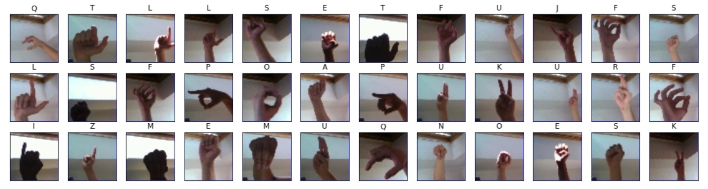

# ASL-Alphabet Image Classification

This small project contains approaches to classify letter/alphabet images that contain gestures of the American Sign Language (ASL). Deep Learning models are used with Keras, including CNNs defined from scratch, transfer learning with models pre-trained on ImageNet and autoencoders in combination with random forests.

## Table of Contents

- [ASL-Alphabet Image Classification](#asl-alphabet-image-classification)
  - [Table of Contents](#table-of-contents)
  - [The Dataset](#the-dataset)
  - [How to Use This](#how-to-use-this)
    - [Dependencies](#dependencies)
  - [Discussion on the Used Models](#discussion-on-the-used-models)
    - [CNN from Scratch](#cnn-from-scratch)
    - [Fine-Tuning and Transfer Learning of ResNet50 and VGG16](#fine-tuning-and-transfer-learning-of-resnet50-and-vgg16)
    - [Autoencoder Compression + Random Forest](#autoencoder-compression--random-forest)
  - [Preliminary Conclusions](#preliminary-conclusions)
  - [Next Steps, Improvements](#next-steps-improvements)
  - [Authorship](#authorship)
  - [Requirements](#requirements)

## The Dataset

The original dataset can be downloaded from Kaggle: [asl-alphabet](https://www.kaggle.com/datasets/grassknoted/asl-alphabet). It consists of `50 x 50 px` color images in which gestures of the `A-Z` symbols are displayed with hands on different backgrounds and lighting conditions. 



For this project, special symbols were ignored (i.e., `nothing`, `space`, `del`) and only the original `train` split was taken. Then, that `train` split was further segregated into the `train` and `test` subsets, with the following sizes:

- `train`: 60,000 observations
- `test`: 15,000 observations (20%)
- labels: 25 (`A-Z`)

The dataset is well balanced: each character has around 2,400 observations in the `train` split and around 600 in the `test` split.

## How to Use This

The project folder contains the following files and directories:

```
asl_alphabet.ipynb      # Main notebook
assets                  # Auxiliary images
requirements.txt        # Dependencies
utils.py                # Helper script: dataset loading
```

The main notebook [`asl_alphabet.ipynb`](asl_alphabet.ipynb) carries out all the research and almost everything is implemented there; the notebook uses [`utils.py`](utils.py) to load the dataset with the specifications mentioned in the previous section.

First, the [dataset](https://www.kaggle.com/datasets/grassknoted/asl-alphabet) needs to be downloaded to the folder `data`, where [`utils.py`](utils.py) expects it.

Then, we have two options:

1. Clone this repository, install the [dependencies](#dependencies) and excute [`asl_alphabet.ipynb`](asl_alphabet.ipynb) locally.
2. Open [`asl_alphabet.ipynb`](asl_alphabet.ipynb) in Google Colab:

[](https://colab.research.google.com/github/mxagar/asl_alphabet_image_classification/blob/main/asl_alphabet.ipynb)

For the last option, the local dataset can be uploaded to your GDrive and from there to the virtual machine instance of your Colab workspace. The steps are explained in the notebook.

### Dependencies

You should create a python environment (e.g., with [conda](https://docs.conda.io/en/latest/)) and install the dependencies listed in the [`requirements.txt`](requirements.txt) file; no specific versions are needed. A short summary of commands required to have all in place is the following:

```bash
conda create -n asl tensorflow python=3.7.13
conda activate asl
conda install pip
pip install -r requirements.txt
```

## Discussion on the Used Models

### CNN from Scratch


### Fine-Tuning and Transfer Learning of ResNet50 and VGG16


### Autoencoder Compression + Random Forest


## Preliminary Conclusions

## Next Steps, Improvements

- [ ] Try gray images. Enough informations should be there and we should
- [ ]
- [ ]


## Authorship

Mikel Sagardia, 2022.  
No guarantees.

## Requirements

- Submit report as a PDF.
- Deep learning model for any task we select, using the dataset of our choice.
- Describe the dataset.
- Explain main objectives: problem type, goals.
- Describe briefly: data exploration, cleaning, feature engineering.
- Variations of a deep learning model: at least 3; different hyperparameters, etc.
- Explain model recommendation: choose explainability / accuracy?
- Explain key findings.
- Next steps: issues, improvements, etc.